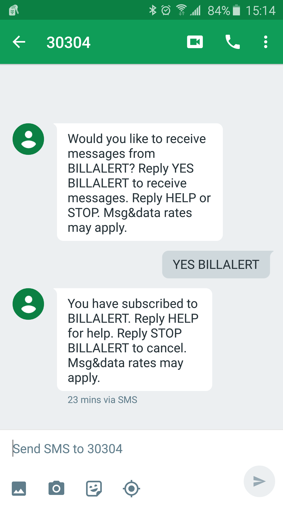
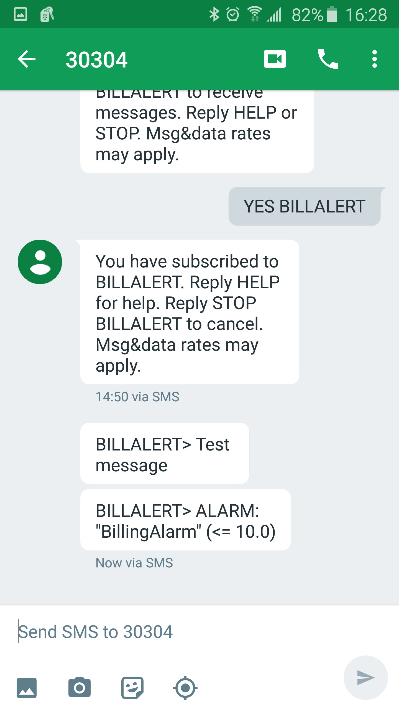

# Homework / Lab Exercises

## SNS

- Make Your CW Billing Alert Send an SMS Text
  - Deliverable: None
  - SNS Subscription Reply:
  
  - CloudWatch SNS Notification Test:
  
- Write a Script to Send Your Phone SMS Messages
  - Deliverable: the Messaging Script Code
        #!/usr/bin/bash
        #
        # send_sms
        #
        # Simple script to send SMS messages via SNS topic, using the AWS cli utility.
        #

        script_filename=${0##*/}
        script_dirname=${0%/*}
        script=${script_filename/.sh$//}

        function usage {
          echo "Usage: ${script} -t '<topic_arn>' -m '<message>'" >&2
          exit 1
        }

        if [[ $# -ne 4 ]]; then
          usage
        fi

        while getopts :t:m: OPT
        do
          case $OPT in
            t) topic_arn="$OPTARG" ;;
            m) message="$OPTARG" ;;
            \*|\?) echo "Error: Invalid Option $OPTARG" >&2
                   usage ;;
          esac
        done

        # Use subject/message format to enforce SMS character limits, and allow for
        # extending to handle sending longer messages to topics with email endpoints
        # later
        aws sns publish --topic-arn "$topic_arn" --subject "$message" --message "$message"

- Configure S3 Bucket to Notify on Object Creation
  - Deliverable: None
- Configure a Server to Save an HTTP/S Notification
  - Configure an EC2 Instance to Accept Traffic on Port 80
  - Configure a Web Stack to Handle POST’s on Port 80
    - Ruby Sinatra is Great Here: http://www.sinatrarb.com
    - Python Flask is Also Usable: http://flask.pocoo.org
  - Simply Print the Result (or Save it to a File)
  - Deliverable: the Code to Run The Server

## CloudWatch

- Set an Alarm When an EC2 Instance CPU Reaches 50%
  - Verify that It Works by Adding CPU Load
  - Deliverable: the Command Line to Create the Alarm  
        $  aws cloudwatch list-metrics --namespace AWS/EC2 --metric-name CPUUtilization
        [...]
        $ aws cloudwatch put-metric-alarm \
        > --alarm-name cb99-cw-ec2cpu --alarm-description "EC2 CPU Utilization (>50%)" \
        > --namespace 'AWS/EC2' --metric-name CPUUtilization --statistic Average \
        > --period 300 --evaluation-periods 2 --threshold 50 --unit Percent \
        > --comparison-operator GreaterThanThreshold \
        > --dimensions "Name=InstanceID,Value=i-b6ef0536" \
        > --alarm-actions "arn:aws:sns:us-east-1:907677783442:NotifyMe"
- Create an Alarm Based on Your Own Metric
  - Verify that It Works by Triggering the Threshold
  - Deliverable: the Command Line to Create the Alarm and Put the Metric that Triggers It
